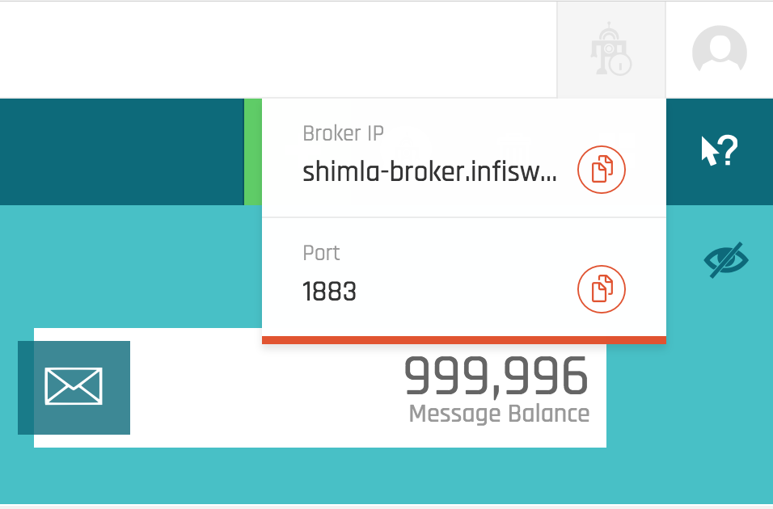

# Infiswift Python Sample SDK

## Overview

The instructions below demonstrate the simple steps to create a MQTT Client using Python and connect it to the infiswift IoT Platform. This guide will cover:

1. How to connect to the Infiswift IoT Platform
2. How to receive and handle the "connected" event
3. How to subscribe to MQTT messages
4. How to publish a message using MQTT
5. How to receive and process the published messages through the subscription

## Creating a Device on the Infswift Admin Portal

1. Go to https://swiftlab.infiswift.tech and sign up for an account. You will need to provide an email address and a password. This will require you to activate the account by clicking a link sent to that email address.
2. Login into your swiftLab account with the above credentials. You will be taken to the Device Console page.
3. Click the ‘+’ sign to create a device.
4. Provide a name for the device. Select the check boxes for both Publisher and Subscriber and hit Save.
5. You will see the device created in the Device Console page.

## Sample Code

**Note:** The sample code uses the paho-mqtt client. It can be installed by running this command in a shell.

```shell
pip install paho-mqtt
```

**Sample Code**

```python
import paho.mqtt.client as mqtt

client_id = ""
username = ""
password = ""

def on_connect(client, userdata, flags, rc):
    print("Connected with result code "+str(rc))
    client.subscribe("home/phone")

def on_message(client, userdata, msg):
    print(msg.topic+" "+str(msg.payload))
    client.publish("home/phone2", msg.payload)

client = mqtt.Client(client_id)
client.on_connect = on_connect
client.on_message = on_message
client.username_pw_set(username, password)
client.connect("shimla-broker.infiswift.tech")

client.loop_forever()
```

The above code will connect to a MQTT broker and subsribe to a topic. It will then receive messages from the specified top and print them to the console. It will also echo messages back on a new topic.

```python
import paho.mqtt.client as mqtt
```

We first need to import our MQTT client

```python
client_id = ""
username = ""
password = ""
```

After that has been done - we will need to populate the client_id, username, and password for the MQTT device that was created in the https://swiftlab.infiswift.tech admin portal. *Note that the client_id is the "Device Id" in the portal* 

Before we connect our MQTT client we need to define some callbacks - actions that will define what our client does when it successfully connects and when it receives a message on a topic.

```python
def on_connect(client, userdata, flags, rc):
    print("Connected with result code "+str(rc))
    client.subscribe("home/phone")
``` 

The first function, on_connect, will be triggered whenever the client connects - or fails to connect - to the MQTT broker service. It will simply print out if it has connected with a status code. A code of 0 means that it has connected where as any other code conveys that an error has occured. 

The callback then subcribes the client to a topic. In this case the topic is "home/phone"

```python
def on_message(client, userdata, msg):
    print(msg.topic+" "+str(msg.payload))
    client.publish("home/phone2", msg.payload)
``` 

The second callback will be triggered whenever a message is recieved by the client - regardless of the topic. It will simply print out the topic it was recieved on and then the actual payload of the topic as well. The callback will then publish the same payload to a different topic, in this case "home/phone2".

```python
client = mqtt.Client(client_id)
client.on_connect = on_connect
client.on_message = on_message
client.username_pw_set(username, password)
client.connect("shimla-broker.infiswift.tech", 8883)
```

The next few lines of code creates a client with the paramters and callbacks defined before and attempts to connect to the broker service. The URL and port for the broker service is provided in the admin portal as well. It can be found by clicking the robot in the top right corner next to the user profile (see screenshot below).



```python
client.loop_forever()
```

Finally the last method call instructs the client to loop forever and wait for messages to be recieved - and to process them as they come along.

The full documentation for the Python MQTT client can be found here: https://pypi.python.org/pypi/paho-mqtt/1.1